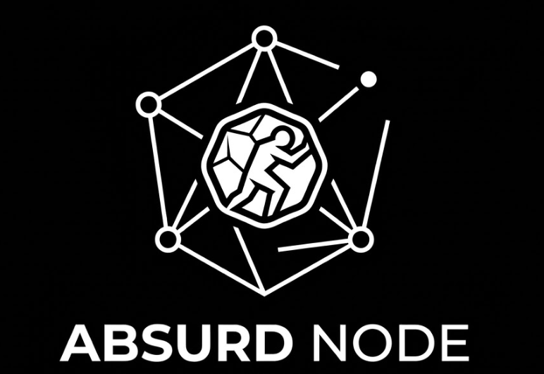
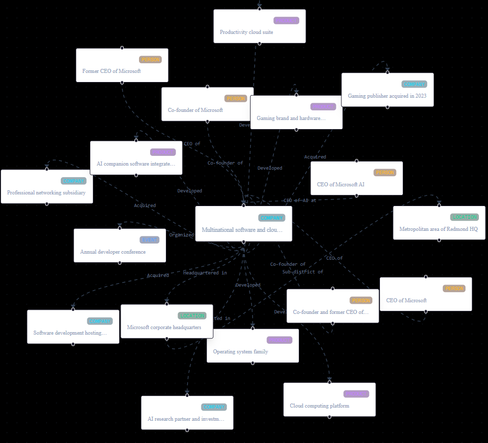

<div align="center">

# Absurd Node


### AI-Powered OSINT Knowledge Graph Platform for Corporate Intelligence

Transform unstructured corporate intelligence into an interactive, searchable Knowledge Graph using AI, NLP, and Graph Databases.

---


</div>

---

## Overview

Absurd Node is an AI-powered Open-Source Intelligence (OSINT) platform designed to automate corporate intelligence investigations. Instead of manually browsing through fragmented sources, the platform transforms publicly available information—including news articles, corporate websites, and organizational profiles—into an interactive Knowledge Graph that enables investigators to discover relationships, explore networks, and identify hidden connections.

The platform combines Natural Language Processing (NLP), Large Language Models, and graph databases to extract entities and relationships from unstructured text before visualizing them through an interactive graph interface.

To ensure consistent development and demonstration environments, the application includes a built-in Mock Mode that automatically serves predefined data whenever a live Neo4j database is unavailable.

---

## Graph Explorer




---

## Features

🔹 **Automated Entity Mapping**  
Extracts organizations, people, locations, and relationships from unstructured corporate data using AI-driven Natural Language Processing.

🔹 **AI Summary Generation**  
Generates concise investigation summaries using the Gemini API, allowing analysts to quickly understand extracted intelligence without manually reviewing every source.

🔹 **Knowledge Graph Construction**  
Transforms extracted entities into an interconnected Knowledge Graph stored within Neo4j for efficient relationship traversal and querying.

🔹 **Interactive Graph Visualization**  
Visualizes entities and their relationships using React Flow, enabling users to explore connections through an intuitive graph interface.

🔹 **Neo4j Integration**  
Uses Neo4j as the primary graph database for storing and querying complex relationship networks that are difficult to represent using relational databases.

🔹 **Mock Mode**  
Automatically falls back to predefined mock datasets whenever a Neo4j instance is unavailable, allowing the application to remain fully functional for development and demonstrations.

🔹 **Responsive Dashboard**  
Provides investigation statistics, graph summaries, and intelligence metrics through a clean dashboard interface.

---

## Technology Stack

### Frontend

- Next.js (App Router)
- React
- TypeScript
- Tailwind CSS
- React Flow

### Backend

- FastAPI
- Python
- Pydantic
- Uvicorn

### Database

- Neo4j Graph Database

### Artificial Intelligence

- Google Gemini API
- Natural Language Processing (NLP)
- Automated Entity Extraction
- AI Summary Generation

---

## System Architecture

```
               Public Corporate Data
      (News, Websites, Company Profiles)
                     │
                     ▼
           NLP Entity Extraction
                     │
                     ▼
         Relationship Identification
                     │
                     ▼
      AI Summary Generation (Gemini)
                     │
                     ▼
        Knowledge Graph Construction
                     │
           ┌─────────┴─────────┐
           │                   │
           ▼                   ▼
        Neo4j             Mock Dataset
           │                   │
           └─────────┬─────────┘
                     ▼
             FastAPI Backend
                     │
                     ▼
            Next.js Frontend
                     │
                     ▼
        Interactive Graph Explorer
```

```
```
---

## AI Pipeline

```text
Raw Corporate Data
      ↓
Entity Extraction (NLP)
      ↓
Relationship Detection
      ↓
Knowledge Graph Generation
      ↓
Neo4j Storage
      ↓
AI Summary Generation (Gemini)
      ↓
Interactive Graph Visualization
```
---

## Installation

### Clone Repository

```bash
git clone <repository-url>
cd absurd-node
````

### Frontend

```bash
npm install
npm run dev
```

### Backend

```bash
python -m venv .venv
```

Activate the environment.

Install dependencies.

```bash
pip install -r requirements.txt
```

Run the backend.

```bash
uvicorn backend.main:app --reload
```

---

## Environment Variables

Create a `.env` file.

```env
NEO4J_URI=bolt://localhost:7687
NEO4J_USER=neo4j
NEO4J_PASSWORD=your_password

USE_MOCK_DATA=False

GEMINI_API_KEY=your_api_key
```

---

## Mock Mode

For development without Neo4j:

```env
USE_MOCK_DATA=True

NEO4J_URI=
```

When enabled, all graph requests are automatically served from predefined local datasets without requiring a running database.

---

## Design Decisions

🔹 **Graph Database**  
Neo4j was selected over traditional relational databases because OSINT investigations naturally consist of interconnected entities and multi-directional relationships. Graph traversal provides significantly more intuitive querying for investigative workflows.

🔹 **Mock Data Fallback**  
The application automatically switches to local mock services whenever a database connection cannot be established, allowing uninterrupted frontend development and demonstrations.

🔹 **AI-Assisted Investigation**  
Instead of only visualizing data, the platform generates AI-powered summaries to help analysts quickly understand the significance of extracted information.

---

## Performance Optimizations

To maintain responsiveness and prevent browser performance degradation, the visualization engine enforces several constraints.


- 🟡 Maximum traversal depth of **1–2 hops**
- 🟡 Maximum **50 graph nodes** per request
- 🟡 Limited relationship expansion for smooth rendering
- 🟡 Asynchronous FastAPI request handling
- 🟡 Lightweight mock service for offline execution

---

## Current Limitations

- 🔴 Designed primarily for corporate intelligence investigations.
- 🔴 Currently optimized for public data sources.
- 🔴 Graph traversal is intentionally limited to **1–2 hops**.
- 🔴 Maximum of **50 entities** are returned per query to preserve visualization performance.
- 🔴 No authentication or multi-user investigation support.
- 🔴 Live deployment is not currently available.

---

## Future Roadmap

- 🟢 Multi-hop graph exploration
- 🟢 Advanced entity linking
- 🟢 Timeline-based investigation view
- 🟢 Investigation history
- 🟢 Cloud deployment support

---


